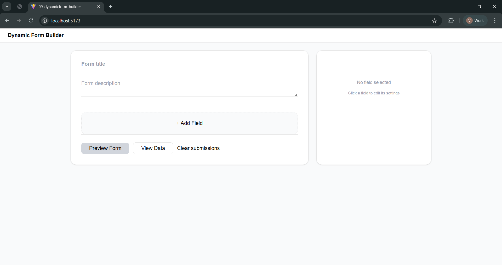

# Dynamic Form Builder (React)

A simple Dynamic Form Builder built using React that allows users to create forms dynamically, preview them, submit responses, and view stored submissions without using any backend.

---

## 📸 UI Preview

Below is the main dashboard interface of the Dynamic Form Builder.

  

---

## 🚀 Features

### 🧩 Form Builder

- Add dynamic fields:
  - Text Input (supports multiple input types)
  - Dropdown
  - Radio Buttons
  - Checkbox
  - Section Title

- Edit field label, placeholder, options, and required status
- Configure options for dropdown, radio, and checkbox fields
- Delete fields anytime

### ⚡ Dynamic Rendering

- Form is generated dynamically from JSON state
- Updates instantly when fields are added or modified
- Supports multiple input types (text, email, number, password, date, etc.)

### ✅ Validation

- Required fields marked with `*`
- Inline error messages on submit
- Type validations supported:
  - Email format
  - Phone number
  - Password length
  - Numeric input

- Prevents submission if validation fails

### 💾 Submission Handling

- Stores responses in **browser localStorage**
- Displays submissions in structured card layout
- Clear all submissions option

### 🎨 UI/UX

- Clean and minimal interface
- Responsive layout
- Builder, Preview, and Data Viewer modes

---

## Tech Stack

- React (Functional Components + Hooks)
- Tailwind CSS
- LocalStorage (for persistence)

---

## Project Structure

src/
│
├── components/
│ ├── common/
│ │ ├── FieldEditor.jsx
│ │ ├── FieldSettings.jsx
│ │ ├── FormRenderer.jsx
│ │ ├── FormPreview.jsx
│ │ └── ResponseViewer.jsx
│ │
│ └── layout/
│ └── Navbar.jsx
│
├── pages/
│ └── dashboard/
│ └── FormBuilderPage.jsx
│
├── lib/
│ └── storageService.js
│
└── App.jsx

---

## How to Run the Project

1. Clone the repository
   git clone <your-repo-link>

2. Install dependencies
   npm install

3. Run development server
   npm run dev

---

## 🔄 How It Works

1. User creates form fields dynamically in the builder
2. Form structure is stored in React state as JSON
3. Preview mode renders the form dynamically
4. Submitted data is saved in localStorage
5. Data viewer displays stored responses

---

## 🎓 Learning Outcomes

- Dynamic UI rendering from JSON data
- Controlled inputs in React
- Form validation handling
- Local storage usage
- Component-based architecture design
- Managing complex UI state in React
